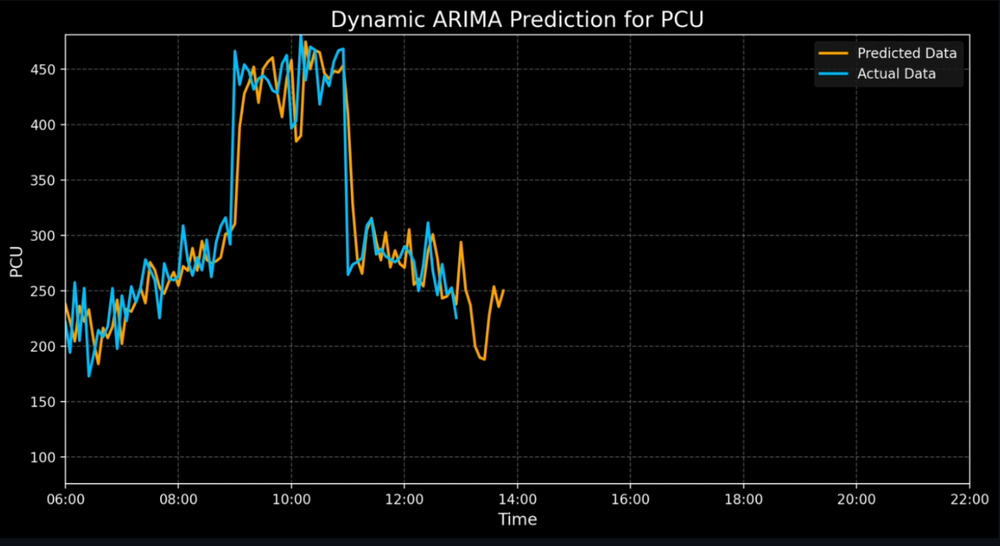

# Yukthi - Smart Traffic Management System


## 📸 Demo Screenshots & Video


### Sample ARIMA Model Working


### Demo Video
https://github.com/TJSreeharish/Real_Time_Traffic_prediction/raw/main/Sample_working_Arima_model.mp4

## 🌟 Overview

Yukthi is an advanced traffic management system that leverages cutting-edge machine learning algorithms to revolutionize urban mobility. The system combines real-time traffic data analysis with predictive modeling to help users optimize their daily commutes and assist traffic authorities in making data-driven decisions.

Key features include traffic pattern prediction using ARIMA and Prophet models, real-time route optimization, and intelligent traffic signal management. The system also incorporates YOLO object detection for vehicle counting and classification, making it a comprehensive solution for modern urban traffic challenges.

## 🚀 Installation

1. Clone the repository
```bash
git clone https://github.com/TJSreeharish/yukthi.git
cd yukthi
```

2. Install required dependencies
```bash
pip install -r requirements.txt
```

3. Run the application
```bash
streamlit run MainPage_final.py
```

## 🛠️ Technologies Used

- **Frontend**: Streamlit
- **Data Processing**: Pandas, NumPy
- **Machine Learning**: Prophet, ARIMA
- **Visualization**: Plotly, Folium
- **Object Detection**: YOLO
- **Geolocation**: GeoPy

## 🔑 Features

- 📊 Traffic Pattern Prediction
- 🗺️ Real-time Route Optimization
- 🚦 Smart Traffic Signal Management
- 🚗 Vehicle Detection and Classification
- 📱 User-friendly Web Interface
- 📍 Interactive Maps and Visualizations

## 📝 Note

Make sure you have Python 3.8+ installed on your system. For optimal performance, we recommend running the application on a machine with at least 4GB RAM.

- When accessing the Live Traffic Data feature, please note that it may take some time to load due to real-time data processing.
